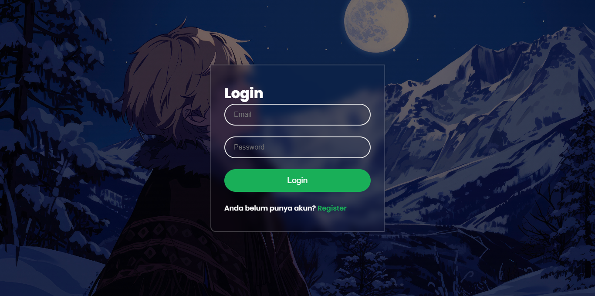
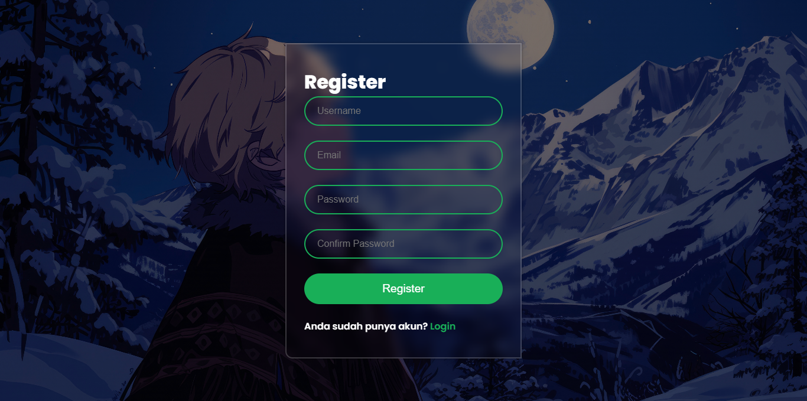
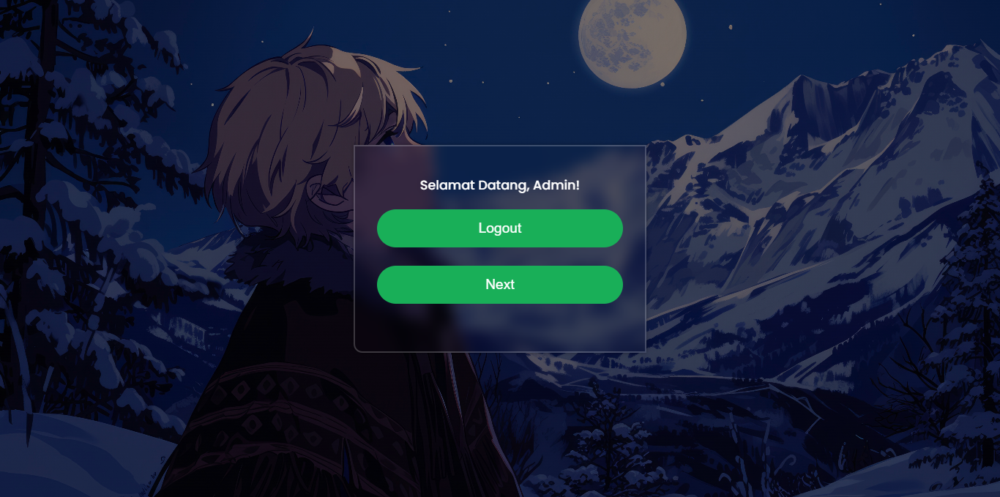
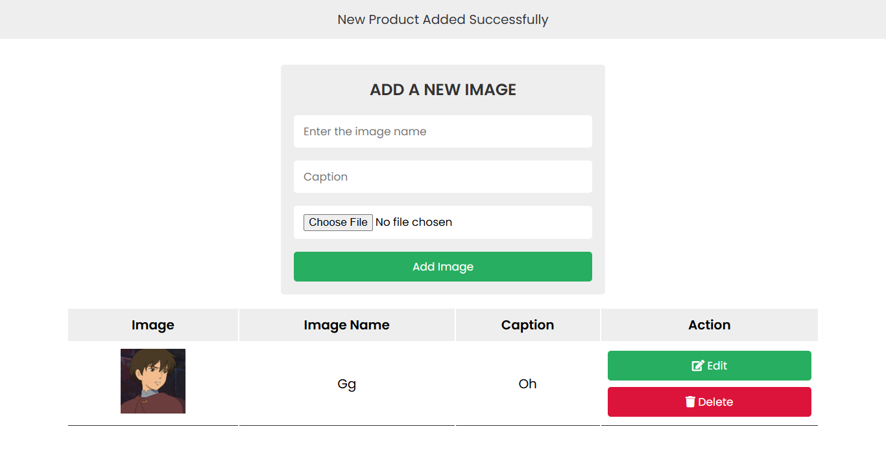
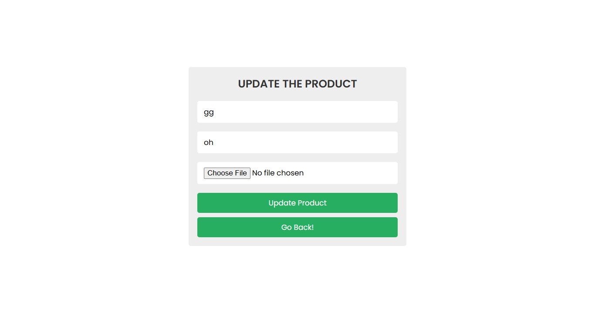
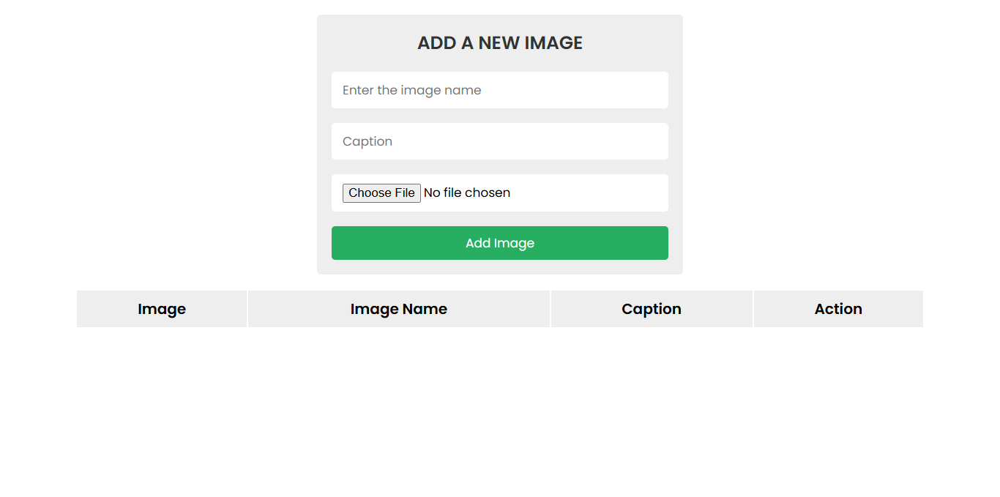

# 📘 Project CRUD Sederhana (Latihan Dasar)

## 📝 Deskripsi

Ini adalah project **CRUD (Create, Read, Update, Delete)** sederhana yang saya buat saat **Ujian Kompetensi Keahlian (UKK)** di SMK sebagai latihan dasar membuat aplikasi web dinamis.  
Project ini **tidak mengelola data spesifik**, hanya sebagai implementasi dasar untuk memahami bagaimana cara menambah, menampilkan, mengedit, dan menghapus data menggunakan **PHP**, **HTML**, **CSS**, dan **MySQL**.

Waktu itu saya belajar secara mandiri dari tutorial-tutorial di YouTube, karena belum ada AI seperti ChatGPT. Tujuan saya adalah memahami logika dasar CRUD, bukan membangun aplikasi kompleks.








## 🎯 Fitur

- ✅ Tambah Data (Create)
- ✅ Tampilkan Data (Read)
- ✅ Edit Data (Update)
- ✅ Hapus Data (Delete)
- ✅ Form input dengan validasi sederhana
- ✅ Tampilan sederhana menggunakan CSS dasar

## 🛠️ Teknologi yang Digunakan

- **PHP**
- **HTML & CSS**
- **MySQL**
- **XAMPP**
- **Code Editor:** Visual Studio Code

## 🚀 Cara Menjalankan

1. Clone atau download repository ini:
   ```bash
   git clone https://github.com/usernamenuh/n4h-crud-sederhana.git
   ```
2. Pindahkan folder hasil clone ke direktori `htdocs` (jika menggunakan XAMPP).
3. Jalankan **Apache** dan **MySQL** melalui XAMPP.
4. Import database:
   - Buka **phpMyAdmin**
   - Buat database baru, misal: `cart_db`
   - Import file `card_db.sql` dari folder project ini
5. Buka browser dan akses:
   ```
   http://localhost/n4h-crud-sederhana/
   ```
